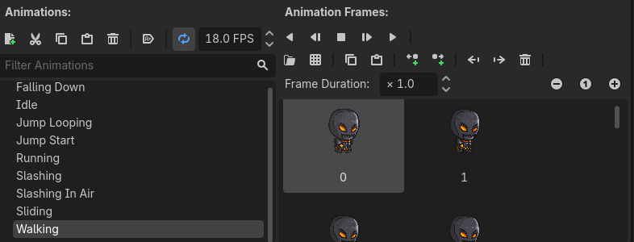
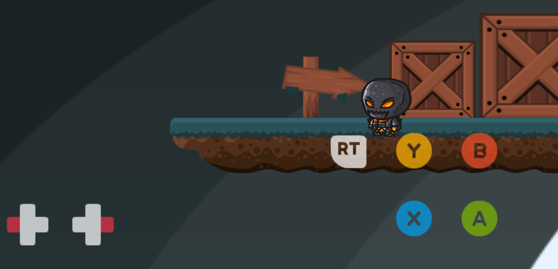
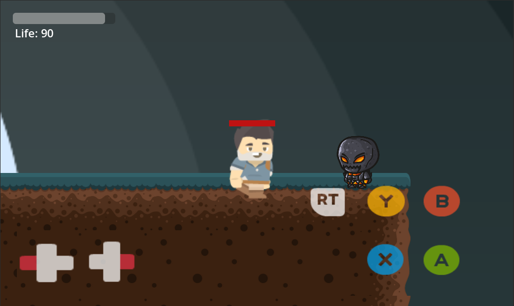
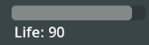
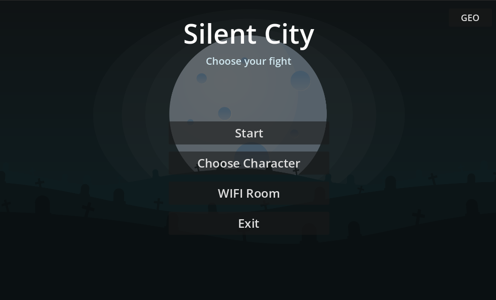
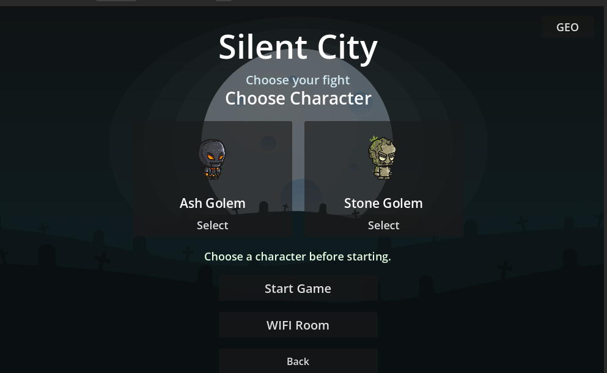
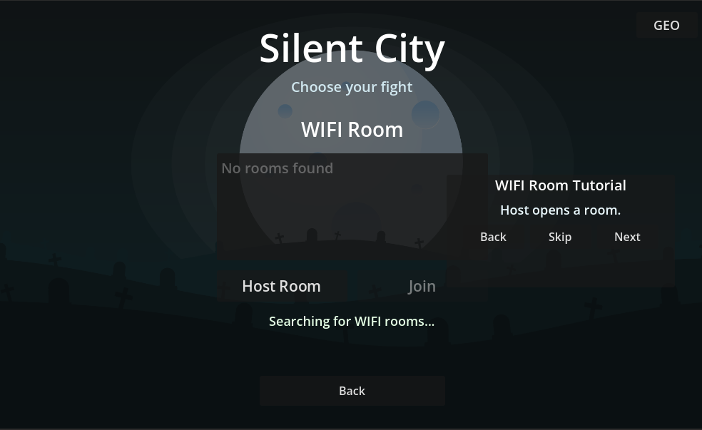

# WIP Game Project

This project is a small 2D platformer being developed in Godot Engine. The game does not yet have an official name, and it is still a work in progress.

## Current Status

- WIP Godot platformer project named Silent City.
- Android/mobile testing is now supported.
- Xbox-style on-screen mobile controls are available.
- A main menu, character selection screen, and WIFI room flow are in progress.
- The player has movement, jump, run, attack, kick, throw, health, death, and restart behavior.
- Enemies spawn around the level, use random character skins, chase the player, fight, and have 100 life.
- Background music and character sound effects are now connected in-game.
- Tile layout, level design, balance, and polish are still being improved.

## Added Today

- Added mobile controls using Xbox input textures.
- Added background music from `resources/background_voice`.
- Added character voices from `resources/character_voices`, including jump, run/step, attack, kick/hit, and throw sounds.
- Added player life with a visible HUD starting at 100.
- Added player death and scene restart when life reaches 0.
- Added enemy characters from the `Characters` folder: Adventurer, Female, Player, Soldier, and Zombie.
- Added random enemy spawning across different platform areas.
- Added enemy health bars with 100 life.
- Added enemy chase and attack behavior when the player is close.
- Fixed the restart bug where enemies entering the kill zone could restart the game.
- Fixed combat range so attacks only work when close and facing the enemy.
- Built Android debug APKs for testing.
- Added the Silent City main menu, character selection, and WIFI room screens.

## Screenshots

Early level view while the environment is being built.

More tiles and platform layout work in progress.

This screenshot shows the current character animation list in Godot. There are nine animations configured for the player:

- `Idle`: default standing pose.
- `Walking`: normal horizontal movement.
- `Running`: faster horizontal movement while holding run.
- `Jump Start`: the start of the jump.
- `Jump Looping`: the upward motion while still rising.
- `Falling Down`: the falling animation after the peak of the jump.
- `Slashing`: ground melee attack.
- `Slashing In Air`: air melee attack.
- `Sliding`: down/crouch movement animation.

The mobile build includes on-screen controls using Xbox-style input textures. The left side controls movement, and the right side has run, throw, kick, attack, and jump buttons.

This shows the player fighting an enemy in the mobile layout. The enemy has a red health bar, and the player life HUD is visible in the top-left corner.

The player life display shows the current health value and a small health bar. It starts at 100 and decreases when enemies hit the player.

The new main menu uses the Silent City title screen with Start, Choose Character, WIFI Room, Exit, and language controls.

The character selection screen lets the player choose between Ash Golem and Stone Golem before starting the game or entering a WIFI room.

The WIFI room screen is used for local multiplayer testing. It includes room discovery, host/join controls, and a short tutorial panel.

## Audio

The game now includes background music and character sound effects. Background music is played quietly during gameplay, while character sounds play for jump, running steps, attacks, kicks, and throwing.

## Mobile Controls

The Android/mobile version uses touch buttons:

- Left side: move left and right.
- Right side: run, throw, kick, attack, and jump.

## Enemies

Enemies are spawned randomly in different areas of the level. Each enemy uses one of the character skins from the `Characters` folder and has 100 life. When an enemy sees the player nearby, it moves toward the player and attacks only when close enough.

More details will be added as the project grows.
